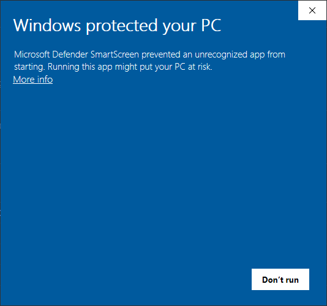
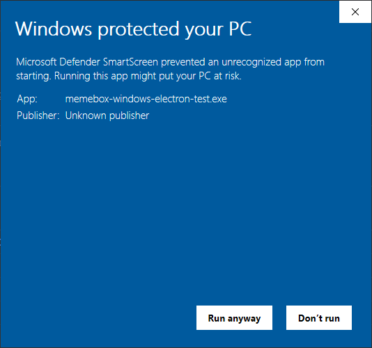

Welcome to this mini MemeBox 101 series where we will go over on how to download,
install, configure and use [MemeBox](MEMEBOX_GITHUB_URL).

# What is MemeBox?

	

A complete management app for
[image / audio / video / iframe / widgets](https://github.com/negue/meme-box/blob/develop/tutorials/type_overview.md)
"media" to be used inside OBS. Or trigger other custom actions.

# What would I use this for?

Well with MemeBox you can do a lot of amazing things that can add a bit of flare
to your live streams or video recordings. The great thing about MemeBox is that
it can be used for the simplest things or for more advanced once such as triggering
certain action based on events or triggers.

# How do I get started?

To get started first pick out which version you want to download and go with that,
this guide should be compatible with both stable and nightly release, but I will be
using the nightly build trough this guide.

# Where can I get it?

There are a few places where you can get it.

Download the [latest release!](MEMEBOX_GITHUB_RELEASE_URL) (currently a bit ouf
of date, new release soon) - the
latest [nightly builds](MEMEBOX_GITHUB_NIGHTLY_RELEASE_URL) (the latest version,
but might have some breaking changes or unstable features.)

## Which version should I get?

This totally depends on you, and what you want. If you only want to test out
the software and see what it is and how to use it, you can go for the latest release
or if you want to check out the latest features that might still be a bit
unstabler than you can go for the nightly release, but you get access to the newest
features that way.

My personal recommendation is the nightly build, but this up to you. :)

# Downloading the software

At the time of writing this the latest nightly release is
[nightly-release-20220109](https://github.com/negue/meme-box-nightly/releases/tag/nightly20220109)
and the stable release is [Release V2021.2.1](https://github.com/negue/meme-box/releases/tag/2021.2.1).

On the release page you will be presented with the option to download multiple
versions of the MemeBox software.

* `com.memebox.memebox-streamdeck.streamDeckPlugin`
	* This is plugin that adds MemeBox controls to the [Streamdeck](https://www.elgato.com/en/stream-deck)
* `memebox-electron.AppImage`
	* This is a file running a desktop version of MemeBox on Linux
* `memebox-headless.exe`
	* This is a file running a headless version of MemeBox on Windows
* `memebox-linux-headless`
	* This is a file running a headless version of MemeBox on Linux
* `memebox-mac-electron.dmg`
	* This is a file running a desktop version of MemeBox on Max
* `memebox-macos-headless`
	* This is a file running a headless version of MemeBox on Mac
* `memebox-windows-electron.exe`
	* This is a file running a desktop version of MemeBox on Windows (installer)
* `memebox-windows-electron.zip`
	* This is a file running a desktop version of MemeBox on Windows (manual installation)

   

Difference between headless and non-headless versions is that the non-headless
version ship with a full desktop application that starts up when you run MemeBox
on your computer, and you can control and setup everything from there. Whereas
the headless version only starts the services needed for everything to run, but
in order to access the interface of the application you need to use your browser.

***NOTE***
I will be downloading and running the ***nightly*** release of `memebox-headless.exe`

***Note*** certain operating system such as Linux and/or Mac might require you
to add the executable flags to the downloaded file before being able to run it.

To add the flag just run the command `chmod +x memebox-file-name`.

During the download process your download might be stopped by your browser because
it thinks the file you're downloading might be dangerous, but that is just because
the files are not (as of writing this) digitally signed.

To download the file use the keep option from you browser, for me in Chrome it
looks like this:

By clicking on the little caret (^) icon it shows me the `Keep` options.

# First startup

After you have successfully downloaded the software now is the time to actually
run it and configure it for use.

To start up the application either run the headless version file you downloaded
for your operating system or search within your installed application for the
installed non-headless version to run it.

***NOTE for Windows users***

During your **first** run of the application, your PC might prompt you with a screen
that looks like this:

To still be able to run the application, you can click on the text that says:
`More info` and get the `Run anyway` button which will still run the application.
On the subsequent runs you will not be seeing this prompt unless you download a
new version of the software.

# Configuring MemeBox

When you first open up your MemeBox, if you have downloaded the non-headless
version than it should open up the user interface for you, or if you have downloaded
the headless version you can open your browser and enter an address:
`localhost:<PORT_NUMBER>`. The `<PORT_NUMBER>` will differ depending on which
version you have downloaded. As of writing this, the stable version of the app
runs on the port number `4444` and the nightly build runs on the port `6363`.

In my case the full address would look like: [`localhost:6363`](http://localhost:6363/).

***NOTE*** if you're running your app from the command line, there is an option
to pass the `--port` flag as well and specify on which port number you want your
user interface to be available at. You can find out more in the
[Command line options](https://github.com/negue/meme-box/blob/develop/tutorials/installation.md#commandline-options)
section of the official guide.

[MEMEBOX_GITHUB_URL]:https://github.com/negue/memebox
[MEMEBOX_GITHUB_RELEASE_URL]:https://github.com/negue/meme-box/releases
[MEMEBOX_GITHUB_NIGHTLY_RELEASE_URL]:https://github.com/negue/meme-box-nightly/releases
