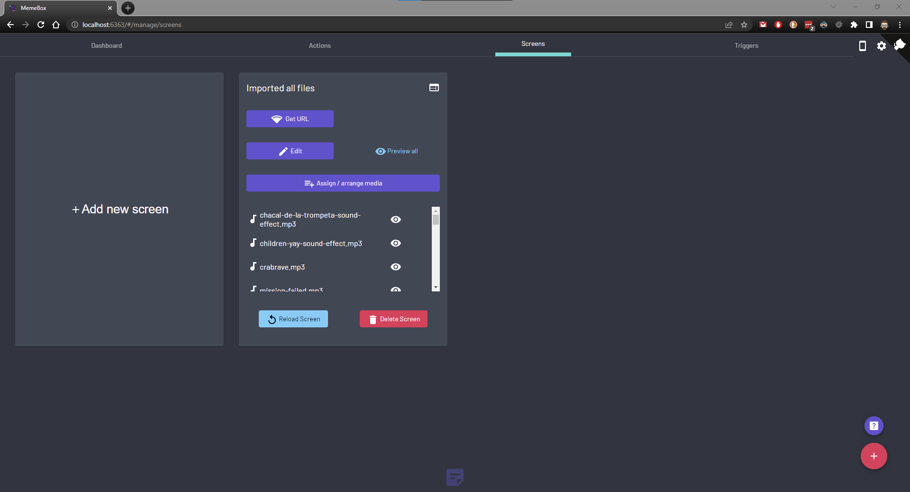

| Title                                | Description                              | Tags                    |
|--------------------------------------|------------------------------------------|-------------------------|
| MemeBox 101 - Arrange & assign media | A guide on how to use the assign / arrange media button  | memebox, obs, streaming |

# Assign / arrange media
In this section we will cover what this feature is and how you can use to enhance your media.

To access this feature, first open up your [MemeBox](MEMEBOX_GITHUB_URL) (if you're using the headless version of the application than you can access it trough your web browser on the address: `localhost:4444` (for stable release) or `localhost:6363` for the nightly build (soon all will use the port `6363`)).

After opening the app, you will be able to see the navigation bar at the top of the screen, and there is an option labeled `Screens` there, clicking it, you should be presented with a screen that looks similar to the following

[MEMEBOX_GITHUB_URL]:https://github.com/negue/memebox
[MEMEBOX_GITHUB_RELEASE_URL]:https://github.com/negue/meme-box/releases
[MEMEBOX_GITHUB_NIGHTLY_RELEASE_URL]:https://github.com/negue/meme-box-nightly/releases